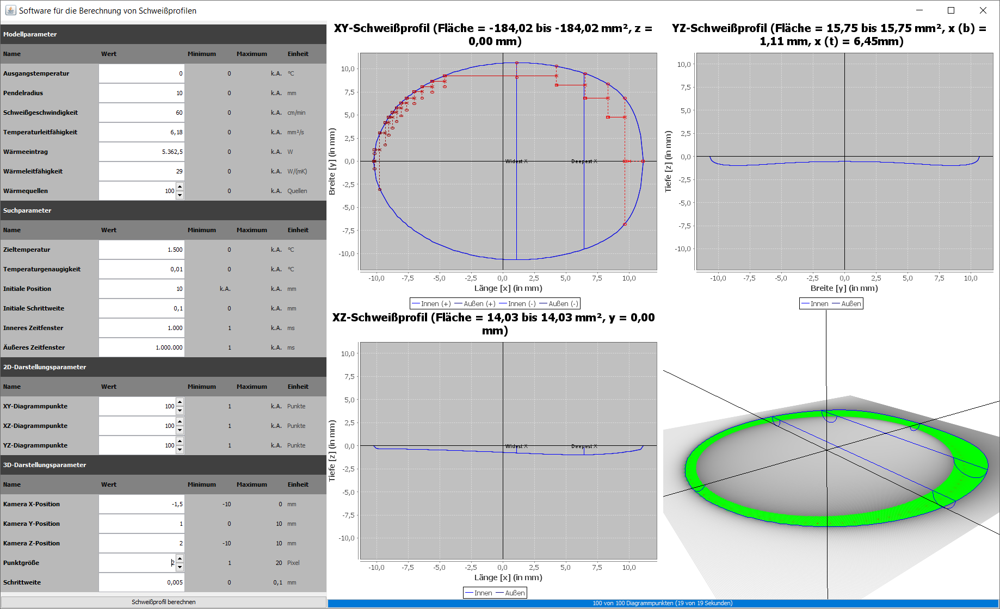

# Welding Simulation

**Tool for the simulation of welding processes and the estimation of the width and the depth of the weld.**
This software is implemented in Java using Swing for the overall GUI and plain OpenGL for 3D rendering.

